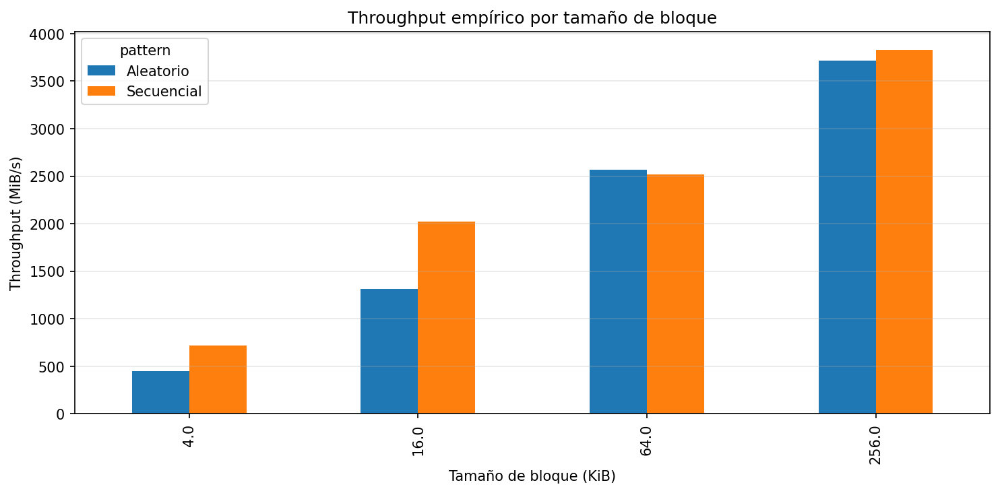
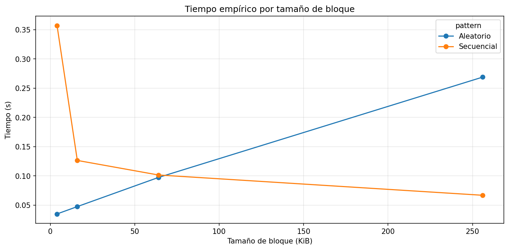
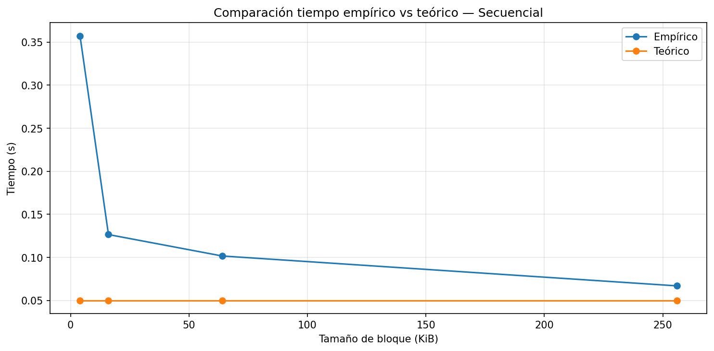
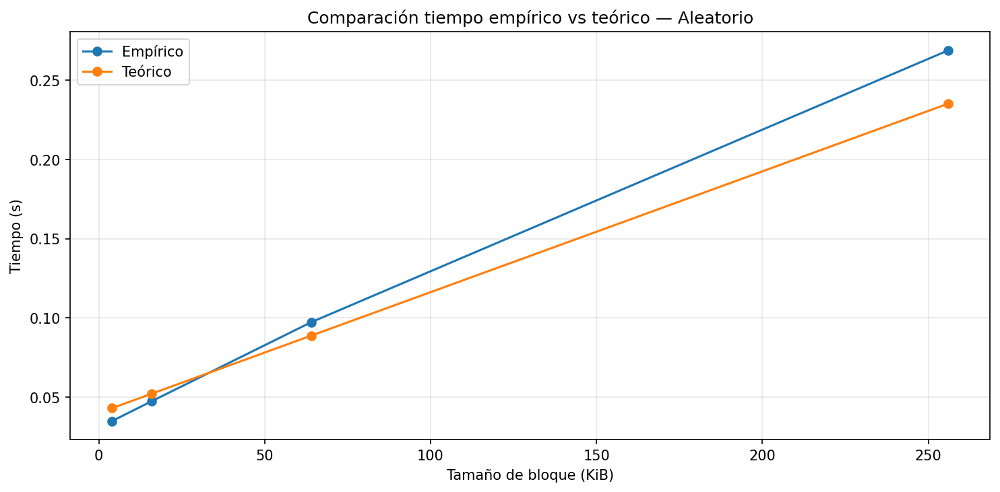
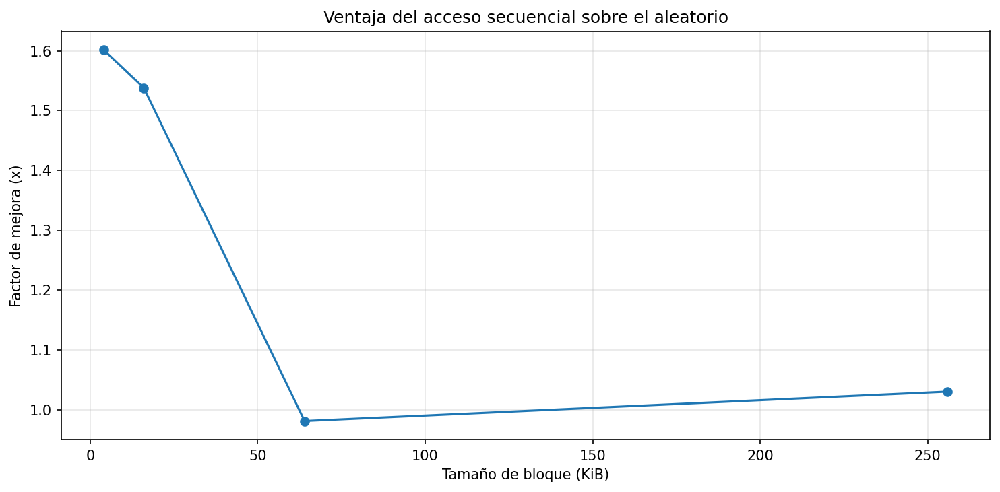

# Laboratorio 3 - Acceso a Disco y Costo de I/O

**Estudiante:** Faber Josue Palacio Cuyan
**Curso:** Estructuras de Datos  
**Universidad:** Universidad de Antioquia  
**Semestre:** 2026-1  

---

## 1. Especificaciones del equipo

| Componente | Información |
|---|---|
| Sistema operativo | Windows 11 25H2 |
| Procesador | Intel Core i5-1235U (10 núcleos) |
| RAM | 16 GB |
| Tipo de disco | SSD NVMe P0327 Phison 512 GB |
| Estado del equipo al medir | En reposo, carga de CPU aproximada del 7% |

> Nota: El experimento se ejecutó localmente, por lo tanto los tiempos medidos corresponden al hardware real del equipo.

---

## 2. Resultados del experimento

### Throughput empírico

### Tiempo empírico por tamaño de bloque

### Teoría vs práctica - Secuencial

### Teoría vs práctica - Aleatorio

### Ventaja del acceso secuencial

---

## 3. Análisis del experimento

### Comparación de patrones
Con base en mis mediciones, el acceso secuencial fue más rápido que el aleatorio sobre todo con bloques pequeños. La mayor diferencia se vio en 4 KiB, donde el speedup fue de aproximadamente 1.6x y en 16 KiB fue de cerca de 1.54x En 64 KiB casi no hubo diferencia, y en 256 KiB la ventaja del secuencial fue pequeña, de alrededor de 1.03x En general, sí era un resultado esperado según la teoría, porque el acceso secuencial reduce la cantidad de accesos no contiguos y aprovecha mejor la lectura continua.

### Efecto del tamaño de bloque
El throughput del acceso aleatorio aumentó a medida que creció el tamaño de bloque. En mis resultados pasó de aproximadamente 447.52 MiB/s en 4 KiB a 1316.33 MiB/s en 16 KiB, luego a 2569.42 MiB/s en 64 KiB y finalmente a 3717.81 MiB/s en 256 KiB. Creo que esto sucede porque en cada acceso se transfieren más datos y, por tanto, el costo de latencia pesa relativamente menos que con bloques pequeños.

### Teoría vs práctica
Un caso donde la medición empírica se alejó bastante del modelo teórico fue el acceso secuencial con bloque de 4 KiB En ese caso, el tiempo empírico fue de aproximadamente 0.3571 s mientras que el teórico fue cercano a 0.0500 s Atribuyo esta diferencia a que el modelo es simplificado y no incluye completamente factores reales como la caché del sistema operativo, la sobrecarga del sistema y el comportamiento real del controlador del disco.

### Tipo de disco
Comparando mis resultados con los valores de referencia de la guía, mi equipo se comportó como un **SSD NVMe**. Esto se nota porque en acceso secuencial obtuve throughputs muy altos, llegando hasta 3830.43 MiB/s lo cual está muy por encima de lo esperable para un HDD y también por encima de un SSD SATA típico. Además, el equipo usa un **NVMe P0327 Phison de 512 GB**, así que el modelo teórico que mejor se ajusta a mis resultados es el de un SSD rápido o NVMe.

### Aplicación práctica
Si tuviera que almacenar una tabla de estudiantes con 1 millón de registros, preferiría leerla de forma **secuencial** siempre que la tarea fuera recorrerla completa, por ejemplo para generar reportes o hacer análisis masivo. Escogería acceso aleatorio solo cuando necesitara buscar registros puntuales. Con base en lo que medí, el acceso secuencial aprovecha mejor el disco, especialmente con bloques pequeños y medianos, y por eso suele ser una mejor opción cuando se necesita alto rendimiento de lectura.

---

## 4. Interpretación de las gráficas

### Gráfica de throughput
La gráfica muestra que las barras más altas aparecen en los tamaños de bloque grandes, especialmente en 256 KiB. En ese caso, el acceso secuencial alcanzó aproximadamente 3830.43 MiB/s y el aleatorio cerca de 3717.81 MiB/s, por lo que ambos tuvieron un rendimiento alto, aunque el secuencial quedó ligeramente por encima.

Esto significa que, a medida que aumenta el tamaño del bloque, el dispositivo aprovecha mejor cada operación de lectura y logra transferir más datos por segundo. En cambio, con bloques pequeños como 4 KiB, el throughput es mucho menor, por ejemplo alrededor de 716.81 MiB/s en secuencial y 447.52 MiB/s en aleatorio.

En general, el patrón que mejor aprovecha la lectura en bloques es el secuencial, porque normalmente obtiene valores más altos y más estables. Sin embargo, en 64 KiB el acceso aleatorio quedó muy cercano e incluso un poco por encima, lo que muestra que en ciertas condiciones la diferencia puede reducirse bastante.

### Gráfica de tiempo
En la gráfica se ve que el tiempo secuencial va bajando cuando el tamaño del bloque aumenta, mientras que el tiempo aleatorio sube, sobre todo en los bloques más grandes. La mayor diferencia entre las dos curvas se nota en 256 KiB porque allí el secuencial tarda mucho menos y el aleatorio aumenta bastante. En general, esto muestra que el acceso secuencial aprovecha mejor los bloques grandes que el acceso aleatorio.

### Comparación empírico vs teórico
Sí, en general las curvas tienen una tendencia parecida, sobre todo en el acceso aleatorio, porque ambas suben cuando aumenta el tamaño del bloque. La mayor separación se ve en el acceso secuencial, especialmente con 4 KiB donde el tiempo empírico es mucho mayor que el teórico.

Esto sugiere que el modelo sirve para mostrar la tendencia general, pero no representa exactamente lo que pasa en el equipo real. En mi caso, el modelo subestima el tiempo real, especialmente en secuencial, probablemente porque no tiene en cuenta factores como la caché del sistema, el sistema operativo y otras sobrecargas del entorno.

### Ventaja del acceso secuencial
La mayor ventaja del acceso secuencial se vio con el bloque de 4 KiB donde el speedup fue de aproximadamente 1.6x Después, esa ventaja fue bajando a medida que aumentó el tamaño del bloque, hasta casi igualarse en 64 KiB y en 256 KiB solo quedó una diferencia pequeña.

Esto me muestra que el acceso secuencial ayuda más cuando se trabaja con bloques pequeños, porque evita muchos saltos y aprovecha mejor la lectura continua. Para el diseño de software, esto implica que conviene organizar los datos de forma contigua siempre que sea posible, ya que así se puede mejorar bastante el rendimiento de lectura.

---

## 5. Preguntas de cierre

### 1. Comparación de patrones
El acceso secuencial fue más rápido que el aleatorio sobre todo con bloques pequeños. La mayor diferencia se vio en 4 KiB**, donde el speedup fue de aproximadamente 1.6x y en 16 KiB fue de cerca de 1.54x En 64 KiB casi no hubo diferencia, y en 256 KiB la ventaja del secuencial fue pequeña, de alrededor de 1.03x. En general, sí era un resultado esperado según la teoría, porque el acceso secuencial reduce la cantidad de accesos no contiguos y aprovecha mejor la lectura continua.

### 2. Efecto del tamaño de bloque
El throughput del acceso aleatorio aumentó a medida que creció el tamaño de bloque. En mis resultados pasó de aproximadamente **447.52 MiB/s** en **4 KiB** a **1316.33 MiB/s** en **16 KiB**, luego a **2569.42 MiB/s** en **64 KiB** y finalmente a **3717.81 MiB/s** en **256 KiB**. Creo que esto sucede porque en cada acceso se transfieren más datos y, por tanto, el costo de latencia pesa relativamente menos que con bloques pequeños.

### 3. Teoría vs práctica
Un caso donde la medición empírica se alejó bastante del modelo teórico fue el acceso secuencial con bloque de 4 KiB En ese caso, el tiempo empírico fue de aproximadamente 0.3571 s mientras que el teórico fue cercano a 0.0500 s Atribuyo esta diferencia a que el modelo es simplificado y no incluye completamente factores reales como la caché del sistema operativo, la sobrecarga del sistema y el comportamiento real del controlador del disco.

### 4. Tipo de disco
Comparando mis resultados con los valores de referencia de la guía, mi equipo se comportó como un **SSD NVMe**. Esto se nota porque en acceso secuencial obtuve throughputs muy altos, llegando hasta 3830.43 MiB/s lo cual está muy por encima de lo esperable para un HDD y también por encima de un SSD SATA típico. Por eso, el modelo teórico que mejor se ajusta a mis resultados es el de un SSD rápido o NVMe.

### 5. Aplicación práctica
Si tuviera que almacenar una tabla de estudiantes con 1 millón de registros, preferiría leerla de forma secuencial siempre que la tarea fuera recorrerla completa, por ejemplo para generar reportes o hacer análisis masivo. Escogería acceso aleatorio solo cuando necesitara buscar registros puntuales. Con base en lo que medí, el acceso secuencial aprovecha mejor el disco, especialmente con bloques pequeños y medianos, y por eso suele ser una mejor opción cuando se necesita alto rendimiento de lectura.

---

## 6. Conclusión final
En este laboratorio confirmé que la información en disco se trabaja por bloques y que eso influye directamente en el rendimiento. Cuando los datos se leen de forma secuencial, el sistema aprovecha mejor la transferencia continua, mientras que en el acceso aleatorio debe hacer muchos accesos separados y por eso el tiempo cambia bastante. En mis resultados se vio que el throughput secuencial llegó hasta **3830.43 MiB/s** con bloques de **256 KiB**, mientras que en **4 KiB** la ventaja del secuencial sobre el aleatorio fue de aproximadamente **1.6x**. Esto se relaciona con el modelo teórico de costo I/O, donde en secuencial se asume un valor de **M** cercano a 1 y en aleatorio **M** crece mucho más. También noté que, aunque el modelo teórico sirve para mostrar la tendencia general, en mi equipo subestimó varios tiempos reales, especialmente en el caso secuencial. Esto muestra que en la práctica también influyen factores como la caché del sistema operativo y la sobrecarga del entorno. Con base en lo medido, en un sistema real yo trataría de organizar los datos de manera contigua y favorecer lecturas secuenciales siempre que sea posible. Así se puede aprovechar mejor el disco y reducir el costo de acceso a los datos.

---

## 7. Resumen numérico

| Tamaño de bloque (KiB) | Tiempo secuencial (s) | Tiempo aleatorio (s) | Throughput secuencial (MiB/s) | Throughput aleatorio (MiB/s) | Speedup seq/rnd |
|---|---:|---:|---:|---:|---:|
| 4 | 0.357139 | 0.034915 | 716.807340 | 447.521803 | 1.601726 |
| 16 | 0.126442 | 0.047480 | 2024.637305 | 1316.332634 | 1.538089 |
| 64 | 0.101547 | 0.097298 | 2520.997645 | 2569.417965 | 0.981155 |
| 256 | 0.066833 | 0.268976 | 3830.425851 | 3717.806583 | 1.030292 |

---

## 8. Archivos incluidos

- `disk_io_lab_guided.ipynb`
- `README.md`
- Carpeta `images/` con las gráficas generadas automáticamente
=======
# lab3-IO_performance-FaberPalacio
